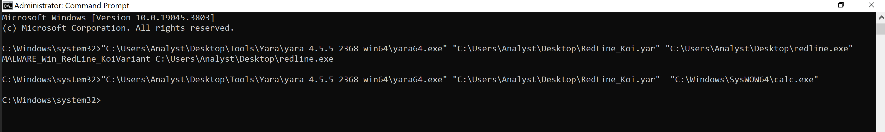
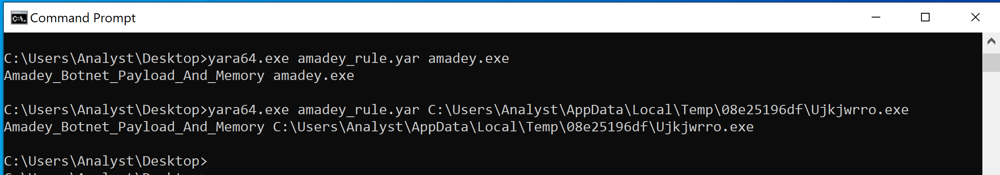
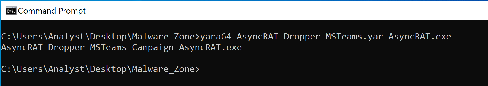

# CTI YARA Rules

Welcome to my Threat Intelligence repository. This space contains custom YARA rules engineered during my independent malware analysis and reverse engineering research.

## Overview
The rules provided here are designed to detect specific behaviors, packers, and in-memory artifacts of commodity malware families. They are written based on dynamic memory analysis and static reverse engineering of live samples.

## Rules Inventory
* **RedLine_Koi.yar**: Detects the reflective loading mechanism (Koi module) of RedLine Stealer variants packed with ConfuserEx. Created after manually unpacking the stage-2 payload from memory.
* 

* **Amadey_Botnet_Memory.yar**: Detects the Amadey botnet payload using a combination of static network/dropper API imports, a hardcoded Campaign ID, and dynamically extracted Command and Control (C2) indicators. Engineered after bypassing a custom modular arithmetic cypher and extracting the decrypted C2 domains directly from CPU registers via x64dbg.
* 

* **AsyncRAT_Dropper_MSTeams.yar**: Detects an AsyncRAT dropper variant utilising a flawed MSTeamsSetup execution chain and UAC bypass. Engineered after dynamic host telemetry analysis revealed the compilation mismatch, and network analysis exposed its TLS certificate pinning sequence.
* 

*  **Gamaredon.yar**: Detects Gamaredon APT (UAC-0010) maldocs utilising Remote Template Injection to bypass static macro scanning. Engineered after performing static analysis on an OpenXML document masquerading as a legacy binary. The rule bypasses DEFLATE compression evasion by targeting extracted `.docx` relationship files (e.g., `settings.xml.rels`) to identify hidden `.ru` C2 infrastructure and custom `.p3l` payload extensions.
* 
   
## About the Author
**Svetoslav Angelov**
Threat Intelligence Analyst | Reverse Engineering Enthusiast
* **Medium Blog:** [https://medium.com/@svetli80]
* **LinkedIn:** [https://linkedin.com/in/svet-angelov-cybersec]

## Disclaimer
These rules are provided for educational and defensive purposes. While tested to minimise false positives against standard Windows binaries, please validate them in your own environment before deploying to production.
